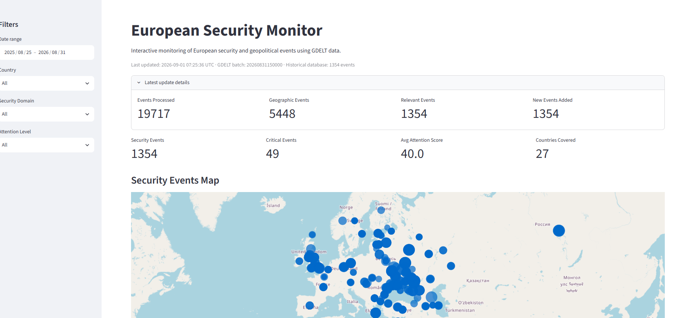
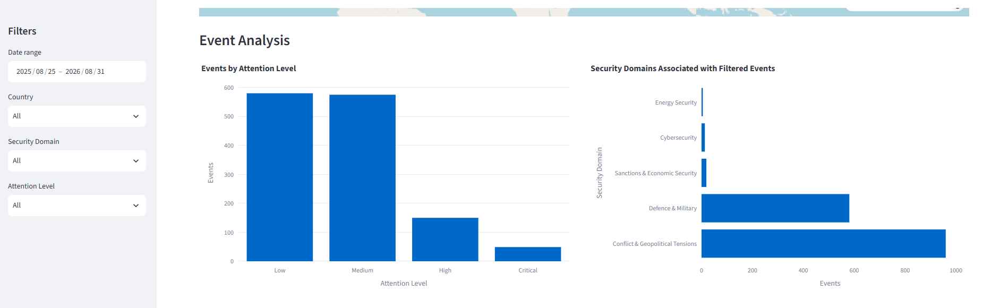

# European Security Monitor

A local, AI-assisted security monitoring pipeline that transforms GDELT event and news metadata into a structured European security intelligence dashboard.

The project combines **GDELT Events + GKG**, geographic filtering, **local semantic classification with Qwen3 through Ollama**, event-level enrichment, an interpretable **Attention Score**, SQLite storage and a Streamlit dashboard.

> **Purpose:** build a reproducible, low-cost monitoring system for defence, geopolitical, cyber, energy and economic-security developments affecting Europe and its strategic neighbourhood.

---

## Dashboard





The dashboard provides an interactive view of security-relevant events, including geographic distribution, security domain, attention level, source information and event details.

---

## What the project does

The pipeline:

1. Checks the latest available **GDELT 2.0 Events and GKG releases**.
2. Downloads and stores the raw files locally.
3. Filters events to **Europe and a defined strategic neighbourhood**.
4. Groups GDELT event records by article/source URL.
5. Classifies each unique article once using a **local LLM**.
6. Applies deterministic post-processing rules to improve consistency and reduce false positives.
7. Propagates the article-level classification back to the related GDELT event rows.
8. Uses GDELT/CAMEO metadata only for downstream enrichment and scoring.
9. Calculates an **AI-aware Attention Score**.
10. Stores the processed history in SQLite.
11. Exposes the results through a Streamlit dashboard.

The production classifier is currently:

```text
article-ai-v3 + post-rules-v4.2
```

The local model used is:

```text
qwen3:4b-instruct
```

Inference runs locally through **Ollama**, so the project does not require a paid AI API.

---

## Security domains

Every relevant article is assigned one primary security domain:

- **Defence & Military**
- **Conflict & Geopolitical Tensions**
- **Cybersecurity**
- **Energy Security**
- **Sanctions & Economic Security**

The classifier is designed to reject high-volume noise such as ordinary domestic politics, local crime, celebrity stories, entertainment, sport, generic business coverage, routine technology news and other content without a substantive security dimension.

---

## Methodology

### 1. Geographic filtering

The first layer narrows the global GDELT stream to monitored European countries and selected strategic neighbours.

This step is intentionally broad. Geographic relevance alone does **not** make an article security-relevant; it only determines which material should be evaluated further.

### 2. Article-level semantic classification

Security relevance is decided at **article level**, rather than independently for every GDELT event record.

For each unique source URL, the classifier considers primarily:

1. article title;
2. textual information derived from the source URL;
3. monitored actor/location countries as supporting geographic context.

The semantic decision deliberately avoids using noisy CAMEO or GKG themes as the primary relevance signal.

A persistent local cache stores successful article classifications so previously processed URLs do not need to be sent to the model again.

### 3. Deterministic post-processing

The base LLM output is refined by high-precision rules that address recurring classification errors, including:

- actual attacks vs. background analysis;
- military interceptions and deployments;
- cyber incidents affecting critical or major infrastructure;
- diplomatic negotiations linked to active security disputes;
- sanctions and terrorist-designation cases;
- geographic edge cases;
- common false positives from local crime, historical content or generic political coverage.

The system also retains a `needs_human_review` flag for ambiguous cases.

### 4. Event-level enrichment

Once an article has been classified as relevant, its decision is propagated to all related GDELT event rows.

CAMEO event codes, Goldstein Scale, media attention, tone and recency are then used as **enrichment signals**, rather than as the semantic relevance decision itself.

---

## Attention Score

Each relevant event receives an Attention Score from **0 to 100**.

The base score combines:

```text
55%  event severity
20%  media attention
15%  negative tone
10%  recency
```

Event severity uses GDELT/CAMEO and Goldstein information, but the final result is constrained by the semantic `event_status` assigned at article level. This prevents, for example, a diplomatic statement from becoming a critical combat event only because of noisy GDELT coding.

Typical event statuses include:

- Actual violence / combat
- Cyber incident
- Military posture / deployment
- Sanctions / economic coercion
- Military cooperation / training
- Threat / warning
- Diplomatic negotiation
- Strategic statement
- Background / analysis

Scores are converted into four attention bands:

- **Critical**
- **High**
- **Medium**
- **Low**

---

## Architecture

```text
                    GDELT 2.0
                 Events + GKG
                      |
                      v
             Geographic filtering
                      |
                      v
             Unique source articles
                      |
                      v
        Local Qwen3 classification
              through Ollama
                      |
                      v
         Deterministic post-rules
                      |
                      v
          Article-level decision
                      |
                      v
      Propagate to GDELT event rows
                      |
                      v
     CAMEO / Goldstein enrichment
                      |
                      v
          AI-aware Attention Score
                      |
                      v
                  SQLite
                      |
                      v
             Streamlit dashboard
```

---

## Project structure

```text
european-security-monitor/
|
|-- app/
|   `-- app.py
|
|-- data/
|   |-- ai/                     # local AI cache (ignored by Git)
|   |-- raw/                    # downloaded GDELT files (ignored by Git)
|   `-- security_monitor.db     # local production database (ignored by Git)
|
|-- docs/
|   |-- dashboard_overview.png
|   `-- dashboard_map.png
|
|-- notebooks/
|   `-- 01_api_exploration.ipynb
|
|-- src/
|   |-- article_security_classifier.py
|   |-- run_monitor.py
|   `-- update_data.py
|
|-- .gitignore
|-- requirements.txt
`-- README.md
```

---

## Installation

### 1. Clone the repository

```bash
git clone <YOUR-REPOSITORY-URL>
cd european-security-monitor
```

### 2. Create a virtual environment

Windows PowerShell:

```powershell
python -m venv .venv
.\.venv\Scripts\Activate.ps1
```

### 3. Install Python dependencies

```powershell
python -m pip install -r requirements.txt
```

The Python requirements are intentionally lightweight:

- pandas
- numpy
- requests
- plotly
- streamlit

### 4. Install Ollama and the local model

Install Ollama separately, then pull the model used by the classifier:

```powershell
ollama pull qwen3:4b-instruct
```

Ollama must be running locally before new, uncached articles can be classified.

---

## Running the project

### Run one data update

```powershell
python src/update_data.py
```

The updater checks the latest GDELT release, skips already processed batches and updates the local SQLite database.

### Run the automatic update service

```powershell
python src/run_monitor.py
```

`run_monitor.py` executes the updater every **15 minutes** while the process is running.

### Start the dashboard

```powershell
python -m streamlit run app/app.py
```

The dashboard reads the latest state stored in `data/security_monitor.db`.

---

## Local data and Git

The repository intentionally excludes large or machine-specific generated files, including:

```text
.venv/
data/raw/
data/ai/
data/*.db
```

This keeps the repository focused on reproducible source code rather than downloaded GDELT archives, local AI cache files or generated databases.

A new environment can recreate its own local state by running the updater.

---

## Why local AI?

Using Ollama provides several advantages for this project:

- no per-request API cost;
- reproducible local inference;
- no dependency on a commercial hosted LLM endpoint;
- persistent caching of previous classifications;
- easy experimentation with prompts and deterministic post-processing.

The system uses AI for **semantic triage**, not as a substitute for source verification or analyst judgment.

---

## Quality assurance

Before the current production architecture was adopted, the classifier was tested against a separate QA database and reviewed for recurring false positives and false negatives.

The validation process focused on difficult cases such as:

- real attacks incorrectly labelled as background analysis;
- military interception vs. combat;
- cyber incidents vs. generic technology stories;
- sanctions with weak strategic relevance;
- local crime incorrectly interpreted as security activity;
- diplomatic negotiations linked to active conflicts;
- geographic ambiguity in cross-border security stories.

The resulting production pipeline combines the LLM classification with deterministic rules and explicit human-review flags.

---

## Limitations

This project is an analytical monitoring prototype, not an official intelligence product.

Important limitations include:

- GDELT event coding and metadata can be noisy or incomplete;
- article classification is often based primarily on headlines rather than full-text extraction;
- a local language model can still produce semantic errors;
- Attention Score is a prioritisation mechanism, not an objective measure of geopolitical importance;
- duplicate or syndicated reporting can affect event volume;
- some ambiguous cases require human review;
- the monitored geographic scope and domain taxonomy reflect project design choices rather than an authoritative security framework.

For those reasons, outputs should be treated as **decision-support signals for exploration and prioritisation**, not verified intelligence assessments.

---

## Possible future improvements

Potential extensions include:

- source reliability weighting;
- entity-level actor tracking;
- country and organisation trend analysis;
- event clustering across syndicated articles;
- retrieval of article body text for difficult cases;
- alerting for high-attention developments;
- temporal anomaly detection;
- automated analyst-style daily or weekly briefs;
- additional validation datasets for classifier benchmarking.

---

## Technology stack

**Data:** GDELT 2.0 Events + GKG  
**Language:** Python  
**AI:** Qwen3 via Ollama  
**Storage:** SQLite  
**Dashboard:** Streamlit + Plotly  
**Data processing:** pandas + NumPy

---

## Disclaimer

This is an independent portfolio and research project using publicly available data. It is not affiliated with GDELT, Ollama, Qwen, any government, defence organisation, intelligence service or European institution.
